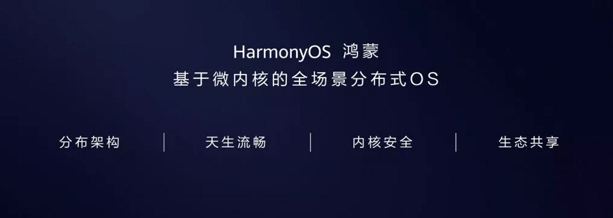
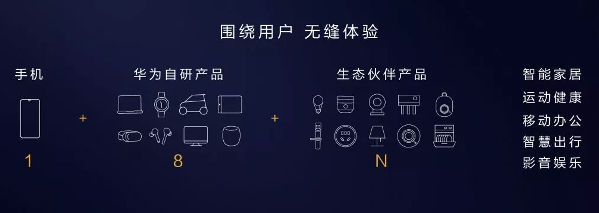
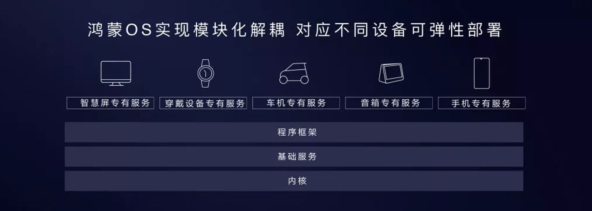

[English Docs](../README.md)  |  [中文文档](doc/README-zh.md)  |  [Türkçe Dökümanlar](doc/README-tr.md)

# HarmonyOS
 

  

> HarmonyOS ile ilgili bilgiler şeyler listesi.

# Ⅰ . HarmonyOS Nedir?
`HarmonyOS` ilk tam dağıtık işletim sistemidir. İşletim sistemi, Huawei tarafından bağımsız olarak geliştirilmiştir. `HarmonyOS` resmi olarak 9 Ağustos 2019 tarihinde Huawei Developers Conference (<HDC.2019>) adlı konferans ile yayınlandı. Huawei, akıllı ekranlar, araç ve giyilebilir terminallerin yerleştirilmesinde öncülük edecektir. Gelecekte, daha akıllı cihazlar açık kaynak kodlu `HarmonyOS` kullanacaktır.

`HarmonyOS` esnek yapısı nedeniyle farklı cihazlarda modüler bağlar kurmayı sağlar. `HarmonyOS` 3 katmanlı bir mimarisi mevcuttur. İlk katman çekirdek, ikinci katman temel servisler ve son üçüncü katman ise programlama yapılan çatıdır. Huawei şu sıralar tercihini Android tarafında kullansa bile bu sistem her zaman mobil cihazlarda kullanılabilecektir. 

`HarmonyOS` altındaki katmanlar şu şekildedir. `HarmonyOS micro kernel`, `Linux kernel` ve [`Lite OS`](https://github.com/Awesome-HarmonyOS/HarmonyOS/tree/master/Huawei_LiteOS) 
Ve gelecekte tamamen `hongmeng` mimarisi olacaktır.

# Ⅱ . Geliştirme Süreci
- [2012] HarmonyOS 2012 yılında Şangaydaki Jiao Tong üniversitesinde geliştirilmeye başlandı.
- [2018.8.24] Huawei tarafından `Huawei HarmonyOS` isimli marka olarak başvuru yapıldı. 14 Mayıs 2019 da `HarmonyOS` isimli marka tescilini duyurdu. `HarmonyOS` isimli markanın özel hakları 14 Mayıs 2019 dan 13 mayıs 2029 yılına kadardır.
- [2019] Huawei iddaa ettiğine göre  1 milyon akıllı telefonda `HarmonyOS` işletim sistemi test edilmeye hazır.
- [2019.5.17] Huawei işletim sistemi takımı kendi tescilli işletim sistemi olan `HarmonyOS` geliştirdi.
- [2019.8.9]  Huawei resmi olarak `HarmonyOS` ismiyle duyurdu ve `HarmonyOS` açık kaynak olacaktır.

# Ⅲ . Features

HarmonyOS, tam sahne akıllı deneyiminin yüksek standart bağlantı gereksinimlerini karşılamak için tasarlanmıştır. Bu nedenle, Huawei 4 büyük özellikle sistem çözümleri ileri sürüyor.

* #### 1. Dağıtılmış mimari ilk işletim sistemi terminalinde terminaller arasında sorunsuz iş akışı sağlamak için kullanılır. 

HarmonyOS "Distributed OS Architecture" ve "Distributed Soft Bus Technology" teknolojileri uygulama geliştiricileri temel teknolojilerin uygulamasını korur. 4 yetenek yani açık iletişim platformu, dağıtık veri yönetimi, dağıtık yetenek zamanlaması ve sanal çevre birimleri geliştiricilere kendi uygulamalarına ait iş mantıklarını geliştirmelerine odaklanmalarını sağlar.
Terminallerde olduğu gibi burada da yeteneklerin kullanılarak kesintisiz deneyimin keyfini çıkarmalarını sağlanır.

* #### 2. Sistemdeki doğal akıcılığı sağlamak için zaman gecikmeli motoru ve yüksek performanslı IPC teknolojisini değerlendirelim.

HarmonyOS, iki teknolojiyi kullanarak mevcut sistemlerin yetersiz performans sorununu çözdü.
Bunlar deterministik gecikme motoru ve yüksek performanslı IPC. Gecikme motorunun belirlenmesi, görev yürütmeden önce sistemde görev yürütmenin öncelik ve zaman sınırını atayabilir.Görev kaynaklarını zamanlamaya göre öncelik verecektir ve uygulamanın cevap dönüş gecikmesi 25.7% oranında azalacaktır. Sıkıştırılmış `Hongmeng` mimarisi süreçler arası iletişimi yüksek oranda arttırırken işlem hızı mevcut sistemlerden beş kat daha yüksektir

* #### 3. Yeniden güvenle inşa edilebilir terminal ekipman bazlı Microkernel Mimari

HarmonyOS mikro-çekirdek dizaynı benimser ve ayrıca düşük gecikme süreli güçlü güvenlik yapıları vardır. Mikro-çekirdek mimarisi basitçe çekirkek fonksiyonları mümkün olduğu kadar çok sistem hizmetini gerçekleştirmekte ve her biri için ek olarak güvenlik katmanı mevcuttur. Mikro-çekirkek sadece en çok basit bilinen servislerini örneğin çoklu işlemci zamanlanması ve çalışması sağlar.

HarmonyOS applies microkernel technology to Trusted Execution Environment (TEE), and reshapes trusted security through formal methods. Formal method is an effective means to verify the correctness of the system and the absence of loopholes from the source by using mathematical methods. Traditional verification methods such as function verification and simulation attack can only be validated in limited scenarios, while formal methods can validate all software running paths through data model. For the first time, Hongmeng OS has applied formal methods to terminal TEE, which significantly improves the security level. At the same time, because the code amount of Hongmeng OS micro-kernel is only one thousandth of that of Linux macro-kernel, its attack probability is greatly reduced.

* #### 4. Through unified IDE to support a single development, multi-terminal deployment, achieve cross-terminal ecological sharing

