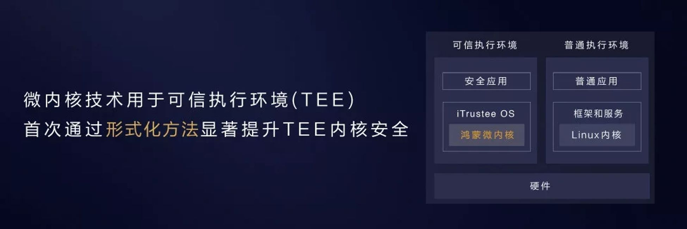
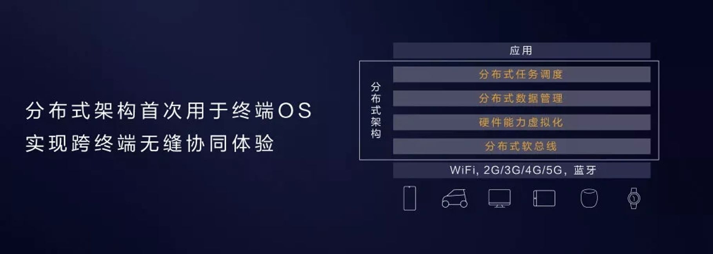

[English Docs](README.md)  |  [中文文档](doc/README-zh.md)

# HarmonyOS
 

  

# Ⅰ. 鸿蒙系统简介
`鸿蒙系统（HarmonyOS）`，是第一款基于微内核的全场景分布式OS，是华为自主研发的操作系统。2019年8月9日，鸿蒙系统在华为开发者大会`<HDC.2019>`上正式发布，华为会率先部署在智慧屏、车载终端、穿戴等智能终端上，未来会有越来越多的智能设备使用开源的`鸿蒙OS`。

`鸿蒙OS`实现模块化耦合，对应不同设备可弹性部署，`鸿蒙OS`有三层架构，第一层是内核，第二层是基础服务，第三层是程序框架 。可用于大屏、PC、汽车等各种不同的设备上。还可以随时用在手机上，但暂时华为手机端依然优先使用安卓。

`鸿蒙 OS` 底层由鸿蒙微内核、Linux 内核、Lite OS 组成，未来将发展为完全的鸿蒙微内核架构。

# Ⅱ. 鸿蒙系统发展进程

- [2012] 2012年华为开始在上海交通大学规划“鸿蒙”操作系统。
- [2019] 华为已经对100万部搭载有自研“鸿蒙”操作系统的手机进行了测试。
- [2019.5.17] 华为操作系统团队开发了其自主产权的“鸿蒙操作系统”。
- [2019.5.24] 注册公告日期是2019年5月14日，专用权限期是从2019年5月14日到2029年5月13日。
- [2019.8.9]  华为官方发布“鸿蒙操作系统”，并且宣布“鸿蒙操作系统”将开源。

# Ⅲ . 鸿蒙系统特点

鸿蒙OS的设计初衷是为满足全场景智慧体验的高标准的连接要求，为此华为提出了4大特性的系统解决方案。

* #### 1. 分布式架构首次用于终端OS，实现跨终端无缝协同体验

鸿蒙OS的“分布式OS架构”和“分布式软总线技术”通过公共通信平台，分布式数据管理，分布式能力调度和虚拟外设四大能力，将相应分布式应用的底层技术实现难度对应用开发者屏蔽，使开发者能够聚焦自身业务逻辑，像开发同一终端一样开发跨终端分布式应用，也使最终消费者享受到强大的跨终端业务协同能力为各使用场景带来的无缝体验。

* #### 2. 确定时延引擎和高性能IPC技术实现系统天生流畅

鸿蒙 OS通过使用确定时延引擎和高性能IPC两大技术解决现有系统性能不足的问题。确定时延引擎可在任务执行前分配系统中任务执行优先级及时限进行调度处理，优先级高的任务资源将优先保障调度，应用响应时延降低25.7%。鸿蒙微内核结构小巧的特性使IPC（进程间通信）性能大大提高，进程通信效率较现有系统提升5倍。

* #### 3. 基于微内核架构重塑终端设备可信安全

鸿蒙OS采用全新的微内核设计，拥有更强的安全特性和低时延等特点。微内核设计的基本思想是简化内核功能，在内核之外的用户态尽可能多地实现系统服务，同时加入相互之间的安全保护。微内核只提供最基础的服务，比如多进程调度和多进程通信等。

鸿蒙OS将微内核技术应用于可信执行环境（TEE），通过形式化方法，重塑可信安全。形式化方法是利用数学方法，从源头验证系统正确，无漏洞的有效手段。传统验证方法如功能验证，模拟攻击等只能在选择的有限场景进行验证，而形式化方法可通过数据模型验证所有软件运行路径。 鸿蒙OS首次将形式化方法用于终端TEE，显著提升安全等级。同时由于鸿蒙OS微内核的代码量只有Linux宏内核的千分之一，其受攻击几率也大幅降低。

* #### 4. 通过统一IDE支撑一次开发，多端部署，实现跨终端生态共享

鸿蒙OS凭借多终端开发IDE，多语言统一编译，分布式架构Kit提供屏幕布局控件以及交互的自动适配，支持控件拖拽，面向预览的可视化编程，从而使开发者可以基于同一工程高效构建多端自动运行App，实现真正的一次开发，多端部署，在跨设备之间实现共享生态。华为方舟编译器是首个取代Android虚拟机模式的静态编译器，可供开发者在开发环境中一次性将高级语言编译为机器码。此外，方舟编译器未来将支持多语言统一编译，可大幅提高开发效率。

# IV . 鸿蒙系统资料

## 1. 官方资源

- [官网站点](https://developer.huawei.com)
- [发布信息]
- [安全信息]
- [入门指引]
- [官方文档]

## 2. 下载
- [镜像]

## 3. 架构参考
- [LiteOS](Huawei_LiteOS/README.md)
- [ABI] Application Binary Interface
- [EABI] Embedded Application Binary Interface

## 4. 硬件驱动
- [Device compatibility]
- [Standards & Protocols] 
- [Hareware Quality Specification]
- [Driver Development Kit]
- [Driver Samples]
- [Debugging Tools]
- [Security]
- [5th Gen Drivers and Firmware]
- [Boot and UEFI]
- [ACPI/SoC]
- [Wi-Fi]
- [USB]
- [Printer]

## 5. 开发工具
#### 编译器
- [Ark] 鸿蒙是一款与安卓应用兼容的操作系统，ARK编译器可以提高安卓系统操作的流畅性24%，响应速度44%，第三方应用的流畅性高达60%。

#### SDK
[SDK]

#### IDE
- [LiteOS IDE][Huawei LiteOS Studio](https://static.huaweicloud.com/upload/files/sdk/LiteOS_IDE.zip)

## 6. 社区
- [常见问题和解答](../community/questions.md)

## 7. 书籍
[书籍]

## 8. 相关产品

- [华为荣耀智慧屏](../assets/img/products/honor_smart_screen.md)

## 9. 视频

* [视频讲解]
* [[HDC 2019]华为开发者大会-暨鸿蒙OS及EMUI 10发布会完整视频](https://www.bilibili.com/video/av62922095/)
* [荣耀智慧屏发布会完整视频](https://www.bilibili.com/video/av63069901)

